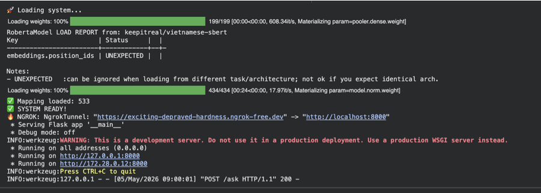

# Traffic Law System Lookup

Hệ thống Tra cứu Luật Giao thông với giao diện Frontend (React/Vite), Backend API (Python/FastAPI) đóng vai trò trung gian (Proxy), và Core AI Model chạy trên Google Colab.

---

## Hướng dẫn cài đặt (Setup) & Chạy ứng dụng (Run)

### 1. Khởi chạy AI Model trên Google Colab
Hệ thống sử dụng Google Colab để chạy mô hình AI (giúp tiết kiệm tài nguyên cho máy tính cá nhân).
1. Load file noteboook LawRAG_ModelHost.jpynb vào GoogleColab, nhớ bật GPU-T4 lên.
2. Tải mapping và nghi_dinh_168 lên Colab.
3. Điền **Ngrok Auth Token** của bạn vào ô tương ứng trong Colab.
4. Chạy toàn bộ các cell trong Colab để khởi động server AI.
5. Cuộn xuống cuối và sao chép đường link **PUBLIC URL** do Ngrok tạo ra (Ví dụ: `https://xxxx-xxxx.ngrok-free.dev`).


### 2. Cập nhật Ngrok URL vào Backend
1. Clone dự án về máy:
   ```bash
   git clone <repository_url>
   cd TrafficLawSystemLookup
   ```
2. Mở file `backend/index.js`.
3. Tìm đến dòng có biến `ngrok_url` ở trong route `app.post('/ask', ...)` và thay thế bằng đường link Ngrok bạn vừa copy từ Colab:
   ```javascript
   const ngrok_url = "https://duong-link-ngrok-cua-ban.ngrok-free.dev";
   ```

---

### 3. Thiết lập & Chạy Backend (Node.js Proxy)

Backend tại máy tính của bạn sẽ đóng vai trò làm cầu nối (proxy) để gửi các câu hỏi từ giao diện Web lên server Colab.

**Bước 1:** Di chuyển vào thư mục backend:
```bash
cd backend
```

**Bước 2:** Cài đặt các thư viện phụ thuộc:
```bash
npm install
```

**Bước 3:** Khởi động server Backend:
```bash
npm run dev
```
Server Backend sẽ chạy tại địa chỉ: **http://localhost:8000**

---

### 4. Thiết lập & Chạy Frontend (React + Vite)

Frontend sử dụng React và Vite để cung cấp giao diện chat/tra cứu cho người dùng.

**Bước 1:** Mở một cửa sổ Terminal mới (để giữ cho backend vẫn đang chạy) và di chuyển vào thư mục frontend:
```bash
cd frontend
```

**Bước 2:** Cài đặt các packages/thư viện:
```bash
npm install
```

**Bước 3:** Khởi động server Frontend:
```bash
npm run dev
```
Giao diện Frontend sẽ chạy tại địa chỉ: **http://localhost:5173** (Hoặc port được Vite cấp trong terminal).

---

## Lưu ý Quan trọng
- **Đường link Ngrok sẽ thay đổi** mỗi lần bạn khởi động lại Colab (nếu dùng gói miễn phí). Hãy luôn nhớ cập nhật lại `ngrok_url` trong file `backend/index.js` mỗi khi bạn chạy lại notebook.
- Đảm bảo rằng **Colab Server** đang chạy và **Backend API (Proxy)** đã được bật trước khi bạn thực hiện đặt câu hỏi trên **Frontend**.
